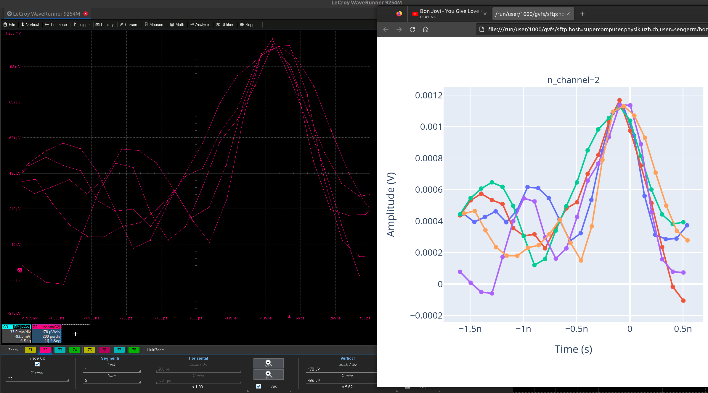

# TeledyneLeCroyPy

Easily control a Teledyne-LeCroy oscilloscope from Python. The package
is designed to be easy to use and user-friendly, returning the data
types that you want to handle (lists, numpy arrays, etc) instead of bytes.


## Installation

To install this package:

```
pip install git+https://github.com/SengerM/TeledyneLeCroyPy
```

This package requires [pyvisa](https://pyvisa.readthedocs.io/en/latest/).

## Usage

Simple example:

```Python
import TeledyneLeCroyPy

o = TeledyneLeCroyPy.LeCroyWaveRunner('TCPIP0::blah.bla.blah.bla::inst0::INSTR')

print(o.idn) # Prings e.g. LECROY,WAVERUNNER9254M,LCRY4751N40408,9.2.0

print('Waiting for trigger...')
o.wait_for_single_trigger() # Halt the execution until there is a trigger.

data = o.get_waveform(n_channel=n_channel)

print(data['waveforms'])
```

More interesting example, acquire data from two channels and plot it:

```Python
import TeledyneLeCroyPy
import plotly.express as px
import pandas

o = TeledyneLeCroyPy.LeCroyWaveRunner('TCPIP0::130.60.165.204::inst0::INSTR')

print(o.idn) # Check the connection.

print('Waiting for trigger...')
o.wait_for_single_trigger()

data = {}
for n_channel in [2,3]:
	data[n_channel] = o.get_waveform(n_channel=n_channel)

wf = []
for n_channel in data:
	for i,_ in enumerate(data[n_channel]['waveforms']):
		df = pandas.DataFrame(_)
		df['n_segment'] = i
		df['n_channel'] = n_channel
		wf.append(df)
wf = pandas.concat(wf)

fig = px.line(
	wf,
	x = 'Time (s)',
	y = 'Amplitude (V)',
	color = 'n_segment',
	facet_col = 'n_channel',
	markers = True,
)
fig.write_html('deleteme.html') # Open this plot to visualize the waveform(s).
```

The previous example should work either with `TimeBase`→`RealTime` as well
as with `TimeBase`→`Sequence` with any number of sequences.

# Additional info

The reconstruction of the waveform data is already implemented within this
package, taking care of the proper time alignment of each sample and the
correct vertical reconstruction. Here an example:


